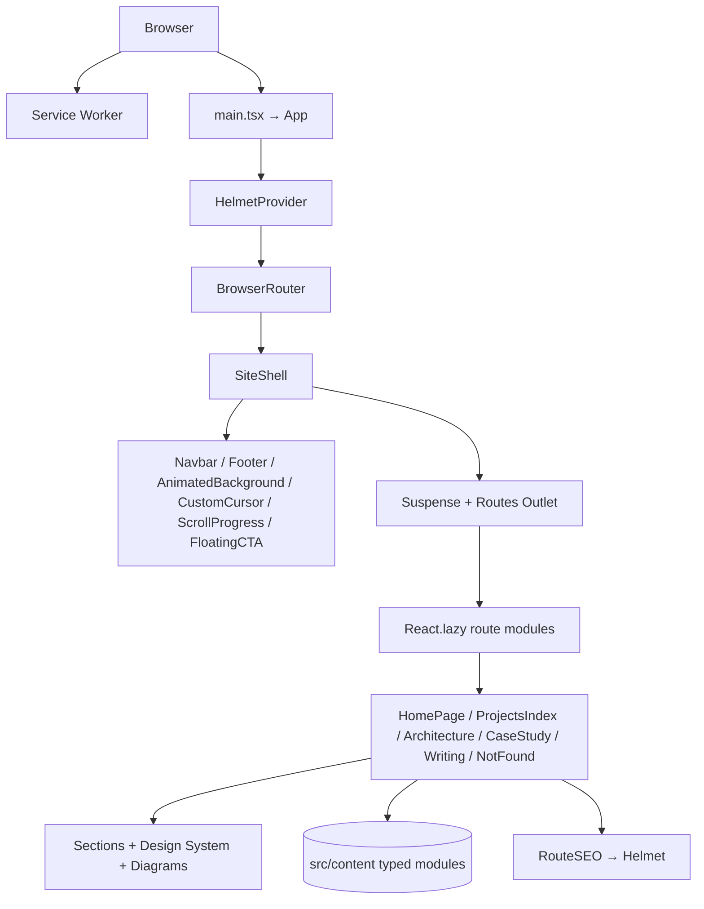
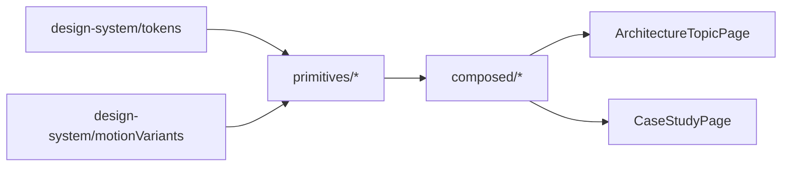
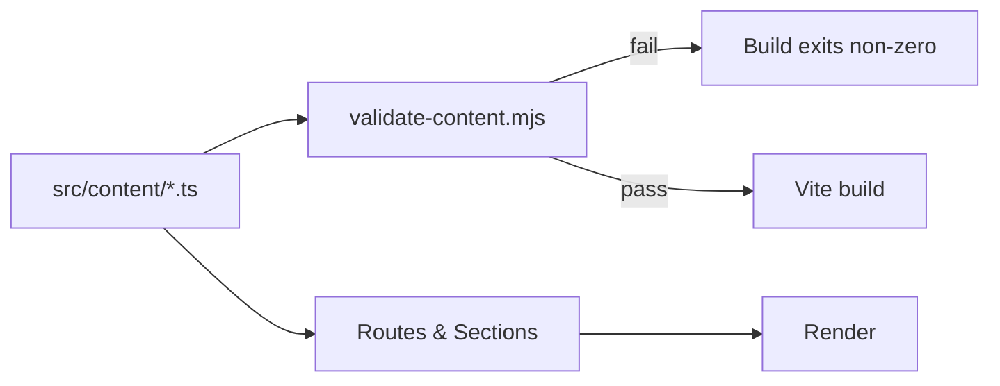

# Design Document

## Overview

This design transforms the existing React 18 + Vite 5 single-page portfolio into a hybrid premium engineering portfolio. The Home page keeps its scroll-based composition; case studies, architecture topics, and articles move behind real client-side routes. TypeScript is adopted alongside existing JSX (`allowJs: true`), a custom SVG diagram primitive library is introduced under `src/components/diagrams/`, and a Stripe/Linear/Vercel/Railway-inspired dark design system is defined in `src/design-system/` with tokens exposed both as CSS custom properties and as TS constants.

The design favors composition over rewrites: existing premium-UX primitives (`AnimatedBackground`, `CustomCursor`, `ScrollProgress`, `FloatingCTA`, `Footer`, `Navbar`) are lifted into a single `<SiteShell>` mounted once globally, and route-level components are loaded via `React.lazy` + `Suspense`. All long-form content is sourced from typed modules in `src/content/`; unauthored fields render through a `<Placeholder>` component instead of fabricated copy.

## Architecture

### High-level Architecture

Stack:

- React 18, Vite 5
- `react-router-dom` v6 with `BrowserRouter` and route-level `React.lazy`
- TypeScript with `allowJs: true`, `strict: true`; existing `.jsx` files unchanged
- `framer-motion` with `LazyMotion` + `domAnimation` to keep bundle small
- `react-helmet-async` for per-route SEO
- `zod` for content-schema validation at build time
- Existing `Performance_Tracker` (web vitals) and `Service_Worker` preserved




### Module Boundaries

- `src/app/` — application bootstrap (providers, router config, route table).
- `src/routes/` — one module per route, each default-exporting a lazy-loadable page component.
- `src/sections/` — composable home-page and template sections (TSX).
- `src/design-system/` — tokens, primitives, motion variants.
- `src/components/ui/` — base components (`Button`, `Card`, etc.) consuming tokens.
- `src/components/diagrams/` — diagram primitives + composed diagrams.
- `src/content/` — typed content modules (Projects, CaseStudies, ArchitectureTopics, Articles).
- `src/data/` — static, non-content data (e.g. nav config, route map).
- `src/types/` — shared TypeScript types.
- `src/utils/` — shared utilities.
- `src/assets/styles/` — global stylesheets including `tokens.css`.

### Folder Structure

```
src/
  app/
    App.tsx                 # provider tree + Router + RouteFocusManager
    routeTable.ts           # canonical route table consumed by Router and sitemap script
    SiteShell.tsx           # global chrome wrapper rendered once
    RouteFocusManager.tsx   # moves focus to <h1> / <main> on route change
    SEO/
      RouteSEO.tsx
      seoConfig.ts
  routes/
    HomePage.tsx
    ProjectsIndexPage.tsx
    ArchitectureIndexPage.tsx
    ArchitectureTopicPage.tsx
    CaseStudyIndexPage.tsx
    CaseStudyPage.tsx
    WritingIndexPage.tsx
    ArticlePage.tsx
    NotFoundPage.tsx
  sections/
    home/
      HeroSection.tsx               # NEW (rebrand pass) — wraps legacy hero copy via tokens
      MetricsSection.tsx            # NEW
      CoreExpertiseSection.tsx      # NEW
      EngineeringPhilosophySection.tsx  # NEW
      FeaturedProjectsSection.tsx   # NEW (wraps legacy Portfolio.jsx data via Content_Schema)
      AboutPreviewSection.tsx       # NEW
    shared/
      RelatedCaseStudies.tsx
      Placeholder.tsx               # renders "TODO: <field>" sentinel
  design-system/
    tokens.ts                  # TS constants mirrored from tokens.css
    motionVariants.ts          # fadeUp / fadeIn / scaleIn shared variants
    breakpoints.ts
    index.ts
  components/
    ui/
      Button.tsx
      Card.tsx
      Section.tsx
      Badge.tsx
      Tag.tsx
      Tabs.tsx
      CodeBlock.tsx
      Container.tsx
      Stack.tsx
      Grid.tsx
      MetricTile.tsx
      Eyebrow.tsx
      Divider.tsx
    diagrams/
      primitives/
        DiagramCanvas.tsx
        DiagramNode.tsx
        DiagramEdge.tsx
        DiagramLane.tsx
        DiagramCluster.tsx
        DiagramAnnotation.tsx
        DiagramLegend.tsx
        DiagramGrid.tsx
        types.ts
      composed/
        DistributedMessagingDiagram.tsx
        AIRoutingDiagram.tsx
        MultiTenantSaaSDiagram.tsx
        WhatsAppInfrastructureDiagram.tsx
        HealthcareWorkflowDiagram.tsx
        DeploymentInfrastructureDiagram.tsx
  content/
    projects.ts
    caseStudies.ts
    architectureTopics.ts
    articles.ts
    schemas.ts                 # zod schemas mirroring src/types/content.ts
  data/
    nav.ts
    routes.ts                  # human-friendly labels paired with routeTable entries
  types/
    content.ts
    diagrams.ts
    seo.ts
  utils/
    placeholder.ts             # branded Placeholder<T> + placeholder() helper
    contentValidation.ts
    motion.ts
  assets/
    styles/
      tokens.css                # NEW — :root CSS custom properties
      global.css                # existing
      layout.css                # existing
      variables.css             # existing (will be deprecated by tokens.css over time)
  components/                   # existing JSX preserved
    HeroSection.jsx
    AboutSection.jsx
    ServicesSection.jsx
    Portfolio.jsx
    Testimonials.jsx
    InsightsSection.jsx
    ContactSection.jsx
    Footer.jsx
    Navbar.jsx
    AnimatedBackground.jsx
    AnimatedBackgroundLite.jsx
    CustomCursor.jsx
    ScrollProgress.jsx
    FloatingCTA.jsx
    ...
scripts/
  generate-sitemap.mjs
  check-freelance-strings.mjs
  validate-content.mjs
public/
  _redirects                    # SPA fallback (option A)
  sitemap.xml                   # regenerated by script
netlify.toml                    # SPA fallback (option B, see decision below)
tsconfig.json
vite.config.ts                  # may stay .js; new tsconfig drives TS files
```

### Routing Model

`BrowserRouter` wraps a single `<SiteShell>` that renders the global chrome (Navbar, AnimatedBackground variant switching, CustomCursor, ScrollProgress, FloatingCTA, Footer) exactly once. The shell renders `<Suspense fallback={<ComponentLoader />}>` around an `<Outlet />`, and route components are imported via `React.lazy`.

```mermaid
graph TD
  Root[/]
  Arch[/architecture]
  ArchSlug[/architecture/:slug]
  CS[/case-studies]
  CSSlug[/case-studies/:slug]
  Writing[/writing]
  WritingSlug[/writing/:slug]
  Projects[/projects]
  NotFound[*]

  Shell[SiteShell layout route] --> Root
  Shell --> Projects
  Shell --> Arch
  Shell --> ArchSlug
  Shell --> CS
  Shell --> CSSlug
  Shell --> Writing
  Shell --> WritingSlug
  Shell --> NotFound
```

`routeTable.ts` is the single source of truth, consumed by:

- `App.tsx` to register routes
- `scripts/generate-sitemap.mjs` to emit `sitemap.xml`
- `RouteSEO` to look up per-route SEO metadata
- Tests to enumerate all routes for property tests

`RouteFocusManager` subscribes to `useLocation()` and, on `location.pathname` change, moves focus to `document.querySelector('main h1')` (or `<main>` if no `h1` is mounted yet — useful while Suspense fallback is showing). It runs after `Suspense` resolves via a `useEffect` keyed on `pathname` and a `requestAnimationFrame` delay.

## Components and Interfaces

### Design System Tokens

Tokens live in two mirrored locations:

- `src/assets/styles/tokens.css` — CSS custom properties on `:root`
- `src/design-system/tokens.ts` — typed TS constants

Both are generated from the same source-of-truth object so that drift fails the build (a small script in `scripts/validate-tokens.mjs` checks parity).

Color tokens (dark theme):

| Token | Purpose |
| --- | --- |
| `--color-background` | Page background |
| `--color-surface` | Default panel |
| `--color-surface-elevated` | Elevated panel (cards on top of cards) |
| `--color-border` | Default border |
| `--color-text-primary` | Primary text |
| `--color-text-secondary` | Secondary text |
| `--color-text-muted` | Muted text and captions |
| `--color-accent-primary` | Primary brand accent |
| `--color-accent-secondary` | Secondary accent |
| `--color-success` | Positive states |
| `--color-warning` | Caution states |
| `--color-danger` | Error states |

Typography:

- Font families: `--font-sans` Inter, `--font-mono` JetBrains Mono.
- Type ramp: `display`, `title`, `h1`, `h2`, `h3`, `h4`, `body`, `caption`, `mono` — exposed as paired `--font-size-*` / `--line-height-*` tokens.

Spacing scale (px):

`--space-1: 4` · `--space-2: 8` · `--space-3: 12` · `--space-4: 16` · `--space-5: 20` · `--space-6: 24` · `--space-8: 32` · `--space-12: 48` · `--space-16: 64` · `--space-24: 96`

Radii: `--radius-sm: 4px` · `--radius-md: 8px` · `--radius-lg: 16px` · `--radius-xl: 24px` · `--radius-full: 9999px`.

Elevation: `--shadow-sm`, `--shadow-md`, `--shadow-lg`, `--glass-surface` (a composite of background + border + backdrop-filter for the rare elevated glass panels).

Motion tokens:

- Durations: `--duration-instant: 80ms`, `--duration-fast: 150ms`, `--duration-base: 240ms`, `--duration-slow: 400ms`, `--duration-page: 600ms`.
- Easings: `--ease-standard: cubic-bezier(0.2, 0, 0, 1)`, `--ease-emphasized: cubic-bezier(0.2, 0, 0, 1.2)`, `--ease-exit: cubic-bezier(0.4, 0, 1, 1)`.
- Distances: `--distance-sm: 4px`, `--distance-md: 8px`, `--distance-lg: 12px`.

`design-system/motionVariants.ts` exports `fadeUp`, `fadeIn`, `scaleIn` variants that read durations and easings from the TS-mirrored tokens. All entrance animations in new code go through this helper so the feel stays consistent.

### Base UI Components

All under `src/components/ui/` in `.tsx`, consuming tokens from `tokens.css` (preferred) or `tokens.ts` (when computed). Each accepts a small, well-typed prop surface; no implicit any.

| Component | Variants / Sizes | Notes |
| --- | --- | --- |
| `Button` | `primary` / `secondary` / `ghost` / `link` × `sm` / `md` / `lg` | Renders `<button>` or `<a>` polymorphically via `as` prop. Focus ring uses `--color-accent-primary`. |
| `Card` | `base` / `elevated` / `glass` | `glass` variant is the only place that uses `--glass-surface`. |
| `Section` | accepts `eyebrow`, `title`, `lead` | Wraps a `<section>` with `aria-labelledby` linked to the rendered title id. |
| `Badge`, `Tag` | semantic variants tied to color tokens | Tag is interactive when `as="button"`. |
| `Tabs` | controlled + uncontrolled | Implements roving-tabindex per WAI-ARIA. |
| `CodeBlock` | language prop, copy button | Uses `--font-mono`. |
| `Container`, `Stack`, `Grid` | layout primitives | Consume spacing scale via props (`space="4"` etc.). |
| `MetricTile` | accepts `label`, `value`, `unit`, `tone` | `value` is rendered verbatim from content; never derived. |
| `Eyebrow`, `Divider` | typographic primitives | |

```ts
// src/components/ui/Button.tsx (signature only)
export type ButtonVariant = 'primary' | 'secondary' | 'ghost' | 'link';
export type ButtonSize = 'sm' | 'md' | 'lg';
export interface ButtonProps extends React.ButtonHTMLAttributes<HTMLButtonElement> {
  variant?: ButtonVariant;
  size?: ButtonSize;
  as?: 'button' | 'a';
  href?: string;
  iconLeft?: React.ReactNode;
  iconRight?: React.ReactNode;
}
```

### Diagram Primitive Library

Located in `src/components/diagrams/primitives/`. All TSX, all consume design tokens via CSS variables on the SVG root, all wrap visual elements in `framer-motion` `m.*` components with reduced-motion guards.

| Primitive | Purpose | Key Props |
| --- | --- | --- |
| `DiagramCanvas` | Responsive `<svg viewBox>` root with `aria-labelledby` pointing at internal `<title>` and `<desc>` | `title`, `description`, `viewBox`, `width`, `aspectRatio` |
| `DiagramNode` | Single node | `variant: 'service' \| 'datastore' \| 'queue' \| 'external' \| 'user' \| 'lambda'`, `label`, `sublabel`, `icon`, `x`, `y`, `width`, `height` |
| `DiagramEdge` | Connector between nodes | `from`, `to` (anchor refs), `style: 'solid' \| 'dashed'`, `arrowhead: 'none' \| 'end' \| 'both'`, `label?`, `animated?: boolean` |
| `DiagramLane` | Horizontal/vertical swimlane | `orientation`, `label`, `nodes` |
| `DiagramCluster` | Grouped boundary with title | `label`, `bounds`, `tone` |
| `DiagramAnnotation` | Callout pointing at a node or coordinate | `target`, `text`, `placement` |
| `DiagramLegend` | Legend panel | `items: { color, label, shape }[]` |
| `DiagramGrid` | Layout helper that places children on a coarse grid | `columns`, `rows`, `gap` |

The library exports a typed `DiagramProps` base interface (see `src/types/diagrams.ts`) and a `useDiagramAccessibilityIds()` hook that returns stable `titleId` / `descId` to wire up `aria-labelledby`.

Composed diagrams under `src/components/diagrams/composed/` — one per entry in `Architecture_Topics` — import only from `primitives/` and `design-system/`. They never embed raw SVG colors or pixel values; everything routes through tokens.



### Page Templates

All under `src/routes/`, each `.tsx` and lazy-loaded:

- `HomePage.tsx` — composes Hero, Metrics, CoreExpertise, EngineeringPhilosophy, FeaturedProjects, AboutPreview, Testimonials, Contact. Legacy JSX sections are imported as-is for the rebrand pass; new sections are TSX.
- `ProjectsIndexPage.tsx` — renders cards for `projects` from `src/content/projects.ts`.
- `ArchitectureIndexPage.tsx` — lists `architectureTopics`.
- `ArchitectureTopicPage.tsx` — resolves slug param, renders composed diagram + prose. Falls through to `NotFoundPage` if the slug is unknown.
- `CaseStudyIndexPage.tsx`, `CaseStudyPage.tsx` — index + detail.
- `WritingIndexPage.tsx`, `ArticlePage.tsx` — index + detail.
- `NotFoundPage.tsx` — 404 with link to `/`.

Each page is wrapped in `<RouteSEO>` with route-specific config from `seoConfig.ts`.

### SiteShell and Global Chrome

`SiteShell` is mounted as the layout route. It renders, exactly once across the app:

- `<Navbar />`
- `<AnimatedBackground />` with the existing variant-switching logic (full vs lite) — lifted out of `App.jsx` so the heuristic runs once globally rather than per route.
- `<CustomCursor />` (existing pointer-device gating preserved)
- `<ScrollProgress />`
- `<FloatingCTA />` (rebranded copy)
- `<Footer />`
- The `<Suspense>` + `<Outlet>` containing route content
- `<RouteFocusManager />` listening to `useLocation()`

`App.jsx` (or its TSX successor) is reduced to provider wiring (`HelmetProvider`, `BrowserRouter`, error boundary) plus a single `<SiteShell>` layout route with child routes.

## Data Models

### Content Schema

Types live in `src/types/content.ts`; values live in `src/content/`.

```ts
// src/types/content.ts
export type ContentStatus = 'draft' | 'published';

export interface ContentBase {
  slug: string;
  title: string;
  summary: string;
  status: ContentStatus;
  tags: string[];
}

export interface Project extends ContentBase {
  role: string;
  caseStudySlug: string | null;
  primaryTech: string[];
  thumbnail?: string;
}

export interface CaseStudy extends ContentBase {
  projectSlug: string;
  role: string;
  duration: string;
  diagramId?: string;
  metrics?: Metric[];
  sections: CaseStudySections; // every section optional; unset → Placeholder
}

export interface CaseStudySections {
  overview?: RichText;
  context?: RichText;
  problem?: RichText;
  constraints?: RichText;
  architecture?: RichText;
  decisions?: RichText;
  tradeoffs?: RichText;
  outcomes?: RichText;
  lessons?: RichText;
}

export interface ArchitectureTopic extends ContentBase {
  diagramId: string;
  prose?: RichText;
  relatedCaseStudySlugs: string[];
}

export interface Article extends ContentBase {
  body?: RichText;
  toc?: TocEntry[];
  readingTimeMinutes: number;
  publishedAt?: string;
}

export interface Metric { label: string; value: string; unit?: string; tone?: 'neutral' | 'positive'; }
export interface TocEntry { id: string; label: string; level: 2 | 3; }
export type RichText = string | RichTextNode[];
```

### Placeholder System

A branded `Placeholder<T>` type and a `placeholder()` helper let content modules declare "user-authored content goes here" without satisfying the type with fake data:

```ts
// src/utils/placeholder.ts
declare const PlaceholderBrand: unique symbol;
export type Placeholder<T> = { readonly [PlaceholderBrand]: T; readonly __field: string };
export const placeholder = <T>(field: string): Placeholder<T> =>
  ({ [PlaceholderBrand]: undefined as unknown as T, __field: field });
export const isPlaceholder = (v: unknown): v is Placeholder<unknown> =>
  typeof v === 'object' && v !== null && PlaceholderBrand in (v as object);
```

Content fields that may legitimately be unset are typed as `T | Placeholder<T>`. The `<Placeholder>` component renders a clearly visible sentinel node:

```tsx
// src/sections/shared/Placeholder.tsx
export const Placeholder: React.FC<{ field: string }> = ({ field }) => (
  <span role="note" aria-label={`Author content required for ${field}`} className="placeholder">
    TODO: {field}
  </span>
);
```

Templates render `isPlaceholder(value) ? <Placeholder field={value.__field} /> : <RichTextRenderer value={value} />`. The system never falls back to generated prose.

### Build-time Content Validation

`src/content/schemas.ts` mirrors the TS types as `zod` schemas. `scripts/validate-content.mjs` runs at build:

1. Imports the content modules.
2. Runs each through its zod schema.
3. For any entry where `status === 'published'`, asserts that no required field is a placeholder.
4. Exits non-zero on failure.

The same script is reused by tests via property-based generation of content fixtures.



## SEO Architecture

- `src/app/SEO/seoConfig.ts` exports a `seoConfig` map keyed by route pattern, each entry containing `title`, `description`, `canonical`, `og`, `twitter`, and optional `structuredData`.
- `src/app/SEO/RouteSEO.tsx` accepts `{ routeKey, overrides? }` and uses `react-helmet-async` to set tags. Slug routes pass per-entry overrides (e.g. article title) into `RouteSEO`.
- `index.html` keeps a baseline title/meta; `RouteSEO` replaces them on hydration. The legacy structured-data block in `src/main.jsx` is moved into `RouteSEO` for `/` and replaced with a `Person` JSON-LD payload.
- `Article` JSON-LD is emitted on `/writing/:slug` from `RouteSEO` using the article entry.
- `scripts/generate-sitemap.mjs` reads `routeTable.ts` plus published slugs from `src/content/*` and writes `public/sitemap.xml`. The script runs as a `prebuild` npm script.
- `public/robots.txt` is updated to reference the regenerated sitemap and to not disallow the new routes.

## Content Lint

`scripts/check-freelance-strings.mjs` scans `dist/` (post-build), `public/`, and `src/content/` for the prohibited strings `"Freelance MERN"`, `"MERN Stack Developer"`, `"Hire MERN"`. It exits non-zero on any hit. Hooks:

- `npm run build` chain: `prebuild` → `validate-content` → `build` → `postbuild` → `check-freelance-strings`.
- CI runs the same chain.

To avoid false positives the script:

- Skips `node_modules/`, `.git/`, `dev-dist/`, `*.map` files.
- Allows `*.test.*` files to mention the strings (so tests can assert their absence).
- Reports each offending file with the matching line.

## Netlify SPA Fallback

The repository already ships a `netlify.toml`. Decision: **keep `netlify.toml` as the canonical configuration** and add an explicit catch-all redirect there. `public/_redirects` is added as a defense-in-depth duplicate so the SPA also works when deployed via plain static hosting.

`netlify.toml` rule (added):

```
[[redirects]]
  from = "/sitemap.xml"
  to = "/sitemap.xml"
  status = 200
  force = true

[[redirects]]
  from = "/robots.txt"
  to = "/robots.txt"
  status = 200
  force = true

[[redirects]]
  from = "/manifest.json"
  to = "/manifest.json"
  status = 200
  force = true

[[redirects]]
  from = "/assets/*"
  to = "/assets/:splat"
  status = 200
  force = true

[[redirects]]
  from = "/*"
  to = "/index.html"
  status = 200
```

`public/_redirects` mirror:

```
/sitemap.xml      /sitemap.xml      200
/robots.txt       /robots.txt       200
/manifest.json    /manifest.json    200
/favicon.ico      /favicon.ico      200
/assets/*         /assets/:splat    200
/*                /index.html       200
```

The order matters: static asset rules come before the catch-all so they short-circuit and never get rewritten to `index.html`.

## Performance

- Each route is a `React.lazy(() => import('../routes/X'))` registered in `routeTable.ts`. `Suspense` falls back to the existing `ComponentLoader`.
- `AnimatedBackground` full/lite switching is lifted into `SiteShell`, where the existing capability heuristic decides which variant to mount. The variant is chosen once at boot and persists across route changes; switching does not re-mount on navigation.
- The existing `preloadObserver` (used to warm chunks for upcoming sections) is updated so its component map points at the new lazy route modules and at the new home sections.
- `framer-motion` uses `LazyMotion` + `domAnimation` to avoid pulling in the full `motion` bundle.
- Web Vitals reporting via the existing `Performance_Tracker` is preserved unchanged.

## Accessibility

- The existing skip link in `index.html` / `App` remains and now targets the `<main>` rendered by `SiteShell`.
- `RouteFocusManager` moves focus to the route's primary `h1` (or `<main>` if no heading exists yet) on `location.pathname` change. Implementation:

```tsx
// src/app/RouteFocusManager.tsx
export const RouteFocusManager: React.FC = () => {
  const { pathname } = useLocation();
  React.useEffect(() => {
    const id = requestAnimationFrame(() => {
      const target =
        document.querySelector<HTMLElement>('main h1') ??
        document.querySelector<HTMLElement>('main');
      if (target) {
        target.setAttribute('tabindex', '-1');
        target.focus({ preventScroll: false });
      }
    });
    return () => cancelAnimationFrame(id);
  }, [pathname]);
  return null;
};
```

- Diagram primitives expose `<title>` and `<desc>` wired via `aria-labelledby` on the SVG root.
- Reduced-motion is gated at the design-system level: `motionVariants.ts` reads `window.matchMedia('(prefers-reduced-motion: reduce)').matches` once and exports either real variants or final-state-only variants. Components import variants from this module rather than defining their own, so the gate applies uniformly.
- Color tokens are chosen so all default text/background pairings meet WCAG 2.1 AA. A `scripts/check-contrast.mjs` script can verify the documented allowed pairings programmatically (covered under tests).

## Animation Guidelines

- All entrance animations route through `motionVariants.ts` (`fadeUp`, `fadeIn`, `scaleIn`).
- Variants only animate `opacity` and small `x` / `y` translates within `--distance-*` tokens.
- Durations are bounded to the motion-token range (150–600ms).
- No infinite repeats, no scale outside `[0.95, 1.05]`, no parallax, no oversized transforms in new code.
- `framer-motion`'s `LazyMotion` wraps the app at `SiteShell` level so per-component bundle is small.

## Migration Plan

Legacy JSX components stay JSX during this feature; only their copy and class hooks are rebranded:

- `HeroSection.jsx` — copy rebrand to engineering positioning; consumes new tokens via class names.
- `AboutSection.jsx` — rebrand copy, source body from new `src/content/` (TSX wrapper renders content + Placeholder fallback).
- `ServicesSection.jsx` — becomes `EngineeringExpertiseSection` via copy + token pass; if scope shifts, replaced by new TSX `CoreExpertiseSection` and the legacy file is removed.
- `Portfolio.jsx` — wrapped by a new TSX `FeaturedProjectsSection` that reads `projects` from `Content_Schema` and renders cards. The legacy file is kept temporarily as the rendering body until the wrapper is fully populated, then deleted.
- `Testimonials.jsx`, `InsightsSection.jsx`, `ContactSection.jsx`, `Footer.jsx`, `Navbar.jsx` — copy + token rebrand only.
- `AnimatedBackground.jsx`, `AnimatedBackgroundLite.jsx`, `CustomCursor.jsx`, `ScrollProgress.jsx`, `FloatingCTA.jsx` — unchanged in behavior; mounted from `SiteShell` instead of from `App.jsx`. Duplicated state/props in `App.jsx` are removed.

New home sections (`MetricsSection`, `CoreExpertiseSection`, `EngineeringPhilosophySection`, `FeaturedProjectsSection`, `AboutPreviewSection`) are authored in TSX and composed inside `HomePage.tsx`.

A separate, non-blocking migration plan tracks future conversion of legacy `.jsx` files to `.tsx`, file-by-file, after this feature ships.

## Correctness Pre-work

The full prework analysis has been recorded via the `prework` tool. Summary of redundancy decisions used to consolidate properties:

- Placeholder-rendering criteria (5.3, 6.3, 7.3, 11.4) collapse into one general `Placeholder rendering` property.
- Reduced-motion criteria (2.6, 16.5, 18.4, 10.5) collapse into one `Reduced motion final-state` property.
- Prohibited-strings criteria (2.2, 3.2, 14.4, 20.1, 20.5) collapse into one `Prohibited strings absent` property covering all artifacts.
- `19.4` (Floating CTA) collapses with `8.2`.
- Per-collection index field-rendering criteria (4.1, 5.1, 6.1, 7.1) become one `Index card renders required fields` property parameterised by collection.

## Correctness Properties

*A property is a characteristic or behavior that should hold true across all valid executions of a system — a formal statement about what the system should do.*

### Property 1: Route Resolution

For any route in the canonical route table, mounting the Router at that path resolves to a registered route component without throwing.

**Validates: Requirements 1.1, 13.3, 15.2**

### Property 2: Client-side Navigation Preserves Document

For any pair of routes `(from, to)` in the route table, navigating from `from` to `to` updates the URL via `react-router-dom` without firing a full-document unload.

**Validates: Requirements 1.3**

### Property 3: Unknown Slug Falls Back to 404

For any slug not present in the corresponding `Content_Schema` collection, navigating to `/architecture/:slug`, `/case-studies/:slug`, or `/writing/:slug` renders `NotFoundPage` with a link to `/`.

**Validates: Requirements 1.4**

### Property 4: Global Chrome Ubiquity

For any route in the route table, `Navbar`, `Footer`, `AnimatedBackground`, `CustomCursor`, `ScrollProgress`, and `FloatingCTA` each mount exactly once on the rendered tree.

**Validates: Requirements 1.5, 19.1, 19.2, 19.3, 19.4**

### Property 5: Prohibited Strings Absent

For any prohibited string in `{"Freelance MERN", "MERN Stack Developer", "Hire MERN"}` and any built artifact in `{rendered HTML for every route, every JSON-LD payload, every `<meta>` tag, sitemap.xml, manifest.json, robots.txt, every file under `src/content/`}`, the artifact does not contain the string.

**Validates: Requirements 2.2, 3.2, 14.4, 20.1, 20.5**

### Property 6: Placeholder Rendering Round-Trip

For any content entry and any field that may be optional, the rendered output equals the authored value when the field is set, and equals the placeholder marker `"TODO: <field>"` when the field is unset; the system never substitutes generated prose.

**Validates: Requirements 3.3, 5.3, 6.3, 6.4, 7.3, 11.3, 11.4**

### Property 7: Published Entry Validation

For any content collection containing at least one entry with `status === 'published'` and at least one required field unset (or held by a `Placeholder<T>`), the build validator exits non-zero; for any collection where every published entry has all required fields set, the validator exits zero.

**Validates: Requirements 11.5**

### Property 8: Index Cards Render Required Fields

For any entry in the `projects`, `architectureTopics`, `caseStudies`, or `writing` collections, the corresponding index page renders the entry's required fields (per collection-specific schema: name/summary/role/tags for projects; title/summary/link for architecture; title/project/role/duration/tags for case studies; title/summary/tags/readingTime for writing).

**Validates: Requirements 4.1, 5.1, 6.1, 7.1, 7.4**

### Property 9: Project–Case-Study Linking

For any `Project` entry, the rendered card contains an anchor to `/case-studies/<caseStudySlug>` if and only if `caseStudySlug !== null`; when `caseStudySlug` is `null` the card contains the text "Case study coming soon" and no anchor pointing into `/case-studies/`.

**Validates: Requirements 4.2, 4.3**

### Property 10: Architecture Topic Renders Diagram and Related Block

For any `ArchitectureTopic` entry, the topic page renders a composed diagram with role `img` and accessible name; the "Related case studies" block is present if and only if `relatedCaseStudySlugs.length > 0`.

**Validates: Requirements 5.2, 5.4, 10.6**

### Property 11: Case Study Metric Fidelity

For any `CaseStudy` entry, the set of metric tiles rendered on the page equals `entry.metrics ?? []` element-wise; the page never renders a metric tile not present in the entry.

**Validates: Requirements 6.4**

### Property 12: Case Study Diagram Embedding

For any `CaseStudy` entry, a composed diagram is embedded on the page if and only if `entry.diagramId != null`, and the embedded diagram corresponds to that id.

**Validates: Requirements 6.5**

### Property 13: Article TOC Conditionality

For any `Article` entry, the article page renders a table of contents if and only if `entry.toc` is set and non-empty.

**Validates: Requirements 7.2**

### Property 14: Design Tokens Round-Trip

For any token key in `tokens.ts`, `getComputedStyle(document.documentElement).getPropertyValue('--' + key)` returns a non-empty value matching the TS constant.

**Validates: Requirements 9.1**

### Property 15: Base Components Consume Tokens

For any base component in `src/components/ui/` rendered with default props, the computed values for color, background, border-radius, and font-family resolve to design-system token values rather than hard-coded literals.

**Validates: Requirements 9.2, 10.3**

### Property 16: Diagram Responsiveness

For any composed diagram and any container width sampled from `[360, 1920]` pixels, the SVG bounding box is less than or equal to the container width and no rendered text node has client width zero.

**Validates: Requirements 10.4**

### Property 17: Diagram Accessibility

For any composed diagram, the SVG root has a `<title>` and `<desc>` child and an `aria-labelledby` attribute referencing both ids.

**Validates: Requirements 10.2, 16.3**

### Property 18: Per-Route SEO Metadata

For any route in the route table, after rendering with `HelmetProvider`, `document.head` contains a `<title>`, `<meta name="description">`, `<link rel="canonical">`, and Open Graph and Twitter Card tags whose values match the route's `seoConfig` entry.

**Validates: Requirements 14.1**

### Property 19: Structured Data Type

For the root document, the emitted JSON-LD parses to an object with `"@type": "Person"`; for any `Article` entry rendered on `/writing/:slug`, an additional JSON-LD block with `"@type": "Article"` is present whose `headline` and `url` match the entry.

**Validates: Requirements 14.2**

### Property 20: Sitemap Inclusion

For any non-slug route in the route table, the regenerated `sitemap.xml` contains a `<loc>` entry for that route; for any content entry, the sitemap contains a `<loc>` entry if and only if `entry.status === 'published'`.

**Validates: Requirements 14.3, 20.2**

### Property 21: SPA Fallback Static Asset Exclusion

For any path in `{"/sitemap.xml", "/robots.txt", "/manifest.json", "/favicon.ico", "/assets/<any>"}`, parsing the Netlify configuration yields no rule that rewrites the path to `/index.html`.

**Validates: Requirements 17.3**

### Property 22: Cold-Mount Route Render

For any route in the route table, mounting `BrowserRouter` with `window.location.pathname` set to that route renders the corresponding route component on first paint (validating the SPA fallback contract).

**Validates: Requirements 17.1, 17.2**

### Property 23: Route-level Code Splitting

For any route in the route table, the registered component is a `React.lazy` value (its `$$typeof` matches the React lazy symbol).

**Validates: Requirements 15.2, 15.3**

### Property 24: Motion Variants Stay Within Tokens

For any motion variant exported from `motionVariants.ts`, the variant's `transition.duration` lies in the closed interval defined by motion-token durations (150–600 ms), and the animated keys are a subset of `{opacity, x, y}`.

**Validates: Requirements 18.1, 18.2, 18.3**

### Property 25: Reduced Motion Yields Final State Immediately

For any component using shared motion variants, when `prefers-reduced-motion: reduce` is set, the initially rendered computed style equals the post-animation final style.

**Validates: Requirements 2.6, 10.5, 16.5, 18.4**

### Property 26: Focus Moves to Primary Heading on Route Change

For any pair of routes `(from, to)`, after navigating from `from` to `to` and the next animation frame, `document.activeElement` is the `<main>` landmark's first `<h1>`, or the `<main>` element itself when no `<h1>` is mounted yet.

**Validates: Requirements 16.2**

### Property 27: Focus Indicator Contrast

For any interactive element rendered through a base UI component, when `:focus-visible` matches, the computed outline (or focus ring) maintains a contrast ratio of at least 3:1 against the underlying background token.

**Validates: Requirements 16.1**

### Property 28: Color Contrast for Documented Pairings

For any documented `(textToken, backgroundToken)` pairing in the design system, the contrast ratio is at least 4.5:1 for body text and at least 3:1 for large text.

**Validates: Requirements 16.4**

### Property 29: Robots and Sitemap Consistency

For any route in the canonical route table, `robots.txt` does not contain a `Disallow` line that matches the route, and `robots.txt` includes a `Sitemap:` line pointing at the regenerated `sitemap.xml`.

**Validates: Requirements 20.3**

### Property 30: Freelance-String Lint Soundness

For any test artifact constructed with or without one of the prohibited strings inserted, running `scripts/check-freelance-strings.mjs` exits non-zero if and only if at least one prohibited string is present in the scanned set.

**Validates: Requirements 14.4, 20.5**

## Risks and Tradeoffs

- **TypeScript alongside JSX dual lint config.** ESLint must run with both `@typescript-eslint/parser` (for `.ts` / `.tsx`) and `eslint`'s default parser (for `.jsx`). Risk: rules drift between the two configs. Mitigation: keep a shared `extends` block and document the two-parser setup in `eslint.config.js`. We will not block the rebrand on full JSX → TSX migration; the migration is tracked as a follow-up.
- **`react-helmet-async` interaction with `react-router-dom` v6.** Both must wrap the tree in the right order: `<HelmetProvider>` outside `<BrowserRouter>` is the safe choice. Risk: if a route changes title before the Helmet flush, the document title flashes the previous value. Mitigation: `RouteSEO` is rendered inside the route component, so its update happens within the route's render phase, before the `RouteFocusManager` effect runs.
- **Sitemap regeneration timing.** The script reads from `src/content/*.ts`, which is TypeScript. Running it from `prebuild` requires either compiling the content modules first or executing them via `tsx` / `esbuild-register`. Risk: divergence between the deployed sitemap and the deployed content. Mitigation: run via `tsx scripts/generate-sitemap.mjs` so the script imports the same TS modules the app uses; fail the build if any published slug is missing.
- **Content lint false positives.** The freelance-string scanner could trip on legitimate test fixtures or on `.map` files containing minified copy. Mitigation: explicit allow-list (`*.test.*`) and exclusion globs (`*.map`, `node_modules`, `dev-dist`). The lint runs against `dist/` after build so source-map noise stays out of scope.
- **`AnimatedBackground` lifted to `SiteShell`.** Lifting the variant-switching state out of `App.jsx` removes duplication but means a single decision is made at boot. Risk: if the user changes capability mid-session (rare, e.g. plugging in a battery saver) the variant won't re-evaluate. Mitigation: the existing heuristic already only re-evaluates on mount, so behavior is preserved; any future runtime re-evaluation is a follow-up.
- **`CustomCursor` and `ScrollProgress` global mount.** Lifting them once means navigation no longer remounts the components. Risk: any internal state assumed reset per route is now persistent. Mitigation: audit those components for route-tied state; they are stateless or animation-only, so this is safe.
- **`React.lazy` + `Suspense` plus `RouteFocusManager`.** Focus management runs on `pathname` change, but the `<h1>` for the new route only mounts after `Suspense` resolves. Mitigation: `RouteFocusManager` queues focus via `requestAnimationFrame` and falls back to `<main>` when no `<h1>` exists yet; an additional `useEffect` re-runs when the loaded route's heading mounts via a `MutationObserver`-free approach (rerun on first child render keyed by `pathname`).
- **`netlify.toml` vs `_redirects` duplication.** Shipping both is intentional but adds maintenance. If the two diverge, Netlify prefers `netlify.toml`. Mitigation: document `netlify.toml` as canonical and treat `_redirects` as a portability fallback.
- **Branded `Placeholder<T>` type ergonomics.** Authoring content modules in TS now requires `placeholder('field')` calls instead of `null`. Risk: friction for the author. Mitigation: provide a small VS Code snippet and document the pattern in `src/content/README.md`.
- **Diagram primitives bundle size.** A custom SVG library means more app code than embedding pre-rendered images. Risk: initial JS payload grows. Mitigation: composed diagrams import only the primitives they use; tree-shaking via Vite plus route-level code splitting keeps the home payload unchanged.
- **Lighthouse baseline regression risk.** Adding routing, Helmet, and zod increases JS. Mitigation: keep `LazyMotion`, lazy routes, and `framer-motion` `m.*` components; measure before/after with the existing Performance_Tracker.

## Testing Strategy

- **Unit tests** cover concrete examples called out by the prework as `EXAMPLE` (home section ordering, About copy, Contact rebrand, FloatingCTA copy, legacy blog disposition).
- **Property-based tests** implement Properties 1–30 above, parameterised over the route table, the prohibited-string set, the content collections, and the design-token catalog. Minimum 100 iterations per property test. Each test is tagged `Feature: portfolio-engineering-rebrand, Property <N>: <text>`.
- **Integration tests** cover Lighthouse / bundle-size baselines via CI scripts (Property class `INTEGRATION` from prework).
- **Smoke tests** cover one-off configuration checks (tsconfig flags, file-extension audits, zod schema parity).
- Property tests use mocks for the SPA fallback (parsing `netlify.toml` and `_redirects` directly) and for `framer-motion` (asserting variant shape rather than animation timing).

## Error Handling

- **Route resolution errors.** Any path that does not match a registered route falls through to the catch-all `<Route path="*" element={<NotFoundPage />} />`. Slug routes additionally validate the slug against the corresponding content collection inside the route component; an unknown slug renders `<NotFoundPage />` rather than throwing.
- **Lazy chunk load failure.** The existing top-level `<ErrorBoundary>` is preserved and now wraps `<Suspense>` inside `SiteShell`. If a route chunk fails to load (offline, deploy churn), the boundary renders a fallback view with a "Reload" affordance and reports to the existing telemetry.
- **Helmet provider errors.** `RouteSEO` wraps Helmet calls in a defensive `try/catch` that logs to console in development and is silent in production; missing optional SEO fields fall back to the route's defaults from `seoConfig.ts`, never to fabricated copy.
- **Content validation failures.** `scripts/validate-content.mjs` exits non-zero with a message naming the offending slug, field, and reason (zod issue path). The build pipeline propagates the failure to CI.
- **Diagram render failures.** Composed diagrams render inside an inner `<ErrorBoundary>` so a malformed diagram cannot blank the surrounding article. The boundary renders a `<Placeholder field="diagram" />` so the page still meets the no-fabrication requirement.
- **Sitemap and freelance-string script failures.** Both scripts exit non-zero with explicit error context; they never write partial output. The freelance-string scanner prints a per-file table of matches so the offending source is obvious.
- **Reduced-motion detection failure.** If `window.matchMedia` is unavailable (e.g. SSR-style render in tests), `motionVariants.ts` defaults to the reduced-motion branch (final state immediately) so behavior degrades to the safer state.
- **`RouteFocusManager` race conditions.** When the lazy chunk for a route is not yet resolved, focus moves to `<main>`; the manager re-runs when the route's `<h1>` mounts via the same `pathname`-keyed effect, so focus eventually lands on the heading without duplicating focus moves on the same path.
