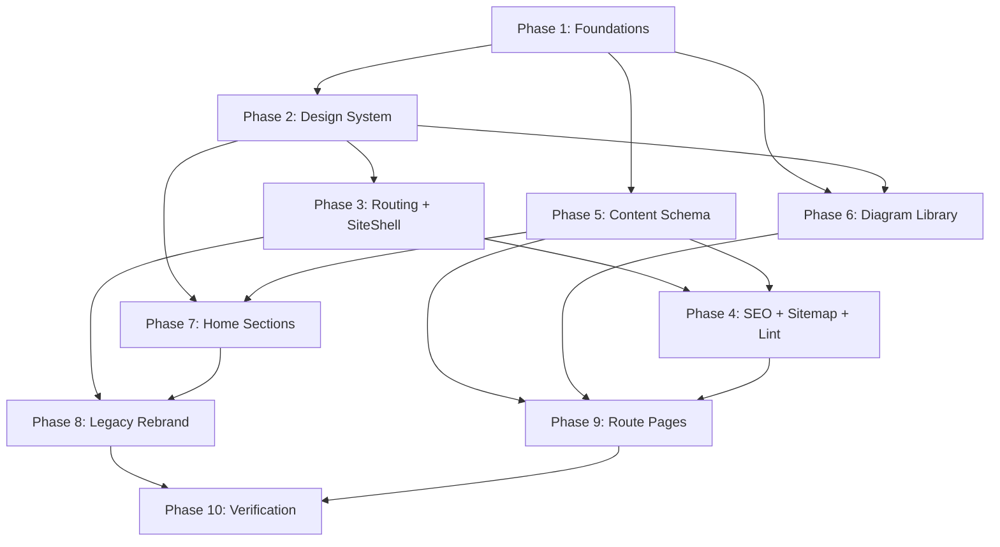

# Implementation Plan: Portfolio Engineering Rebrand

## Overview

Convert the feature design into a series of prompts for a code-generation LLM that will implement each step with incremental progress. Each prompt builds on the previous prompts and ends with wiring things together. There is no hanging or orphaned code that isn't integrated into a previous step. Focus is ONLY on tasks that involve writing, modifying, or testing code.

The plan rebuilds the existing React 18 + Vite 5 site into a hybrid engineering portfolio: TypeScript adopted alongside JSX (`allowJs: true`), real client-side routes for deep content, a token-driven dark design system, a custom SVG diagram primitive library, typed content modules with a `Placeholder<T>` system, build-time content + sitemap + freelance-string validation, and a unified `SiteShell` that mounts global chrome (Navbar / AnimatedBackground / CustomCursor / ScrollProgress / FloatingCTA / Footer) once.

Tasks are grouped into ten phases that mirror the design's migration plan. Each task names the files it creates or modifies and references the requirements clauses and design properties it satisfies.

**Completion Status**: Phases 1-8 are complete. Phases 9-10 are in progress.

## Tasks

### Phase 1 — Foundations

- [x] 1. Foundations: TypeScript, routing, lint, folder skeleton

  - [x] 1.1 Add TypeScript baseline
    - Create `tsconfig.json` at repo root with `allowJs: true`, `strict: true`, `jsx: "react-jsx"`, `moduleResolution: "bundler"`, `paths` for `@/*`, `include` covering `src` and `scripts`.
    - Install dev deps: `typescript`, `@types/react`, `@types/react-dom`, `@types/node`, `tsx`.
    - Add `typecheck` npm script (`tsc --noEmit`).
    - Files: `tsconfig.json`, `package.json`.
    - _Validates: Requirements 12.1, 12.2, 12.5_

  - [x] 1.2 Install routing and validation dependencies
    - Install `react-router-dom@^6`, `react-helmet-async`, `zod`.
    - Install dev deps: `@types/react-router-dom`.
    - Confirm `framer-motion` is present (already in repo).
    - Files: `package.json`, `package-lock.json`.
    - _Validates: Requirements 1.1, 11.1_

  - [x] 1.3 Update ESLint for dual JS/TS parsing
    - Update `eslint.config.js` so `.ts`/`.tsx` files use `@typescript-eslint/parser` and `.js`/`.jsx` files keep the existing parser.
    - Install dev deps: `@typescript-eslint/parser`, `@typescript-eslint/eslint-plugin`.
    - Add a single shared `extends` block so rules don't drift.
    - Files: `eslint.config.js`, `package.json`.
    - _Validates: Requirements 12.1, 12.3_

  - [x] 1.4 Create folder skeleton
    - Create empty (or `.gitkeep`-stubbed) directories: `src/app/`, `src/app/SEO/`, `src/routes/`, `src/sections/home/`, `src/sections/shared/`, `src/design-system/`, `src/components/ui/`, `src/components/diagrams/primitives/`, `src/components/diagrams/composed/`, `src/content/`, `src/data/`, `src/types/`, `scripts/`.
    - Files: directory tree under `src/` and `scripts/`.
    - _Validates: Requirements 13.1, 13.2, 13.3_

### Phase 2 — Design System

- [x] 2. Design system tokens, motion, primitives

  - [x] 2.1 Author `tokens.css`
    - Create `src/assets/styles/tokens.css` with `:root` CSS custom properties for colors (background, surface, surface-elevated, border, text-primary/secondary/muted, accent-primary/secondary, success, warning, danger), typography (font-sans, font-mono, full type ramp), spacing (`--space-1`..`--space-24`), radii, elevation (`--shadow-sm/md/lg`, `--glass-surface`), and motion (`--duration-instant/fast/base/slow/page`, `--ease-standard/emphasized/exit`, `--distance-sm/md/lg`).
    - Import `tokens.css` from `src/index.css` ahead of other globals so tokens cascade.
    - Files: `src/assets/styles/tokens.css`, `src/index.css`.
    - _Validates: Requirements 9.1, 18.1_

  - [x] 2.2 Author `tokens.ts` mirror + parity check
    - Create `src/design-system/tokens.ts` exporting typed constants matching every key in `tokens.css`.
    - Author `scripts/check-tokens.mjs` that parses `tokens.css` and compares keys to `tokens.ts`; non-zero exit on drift.
    - Wire `check-tokens` into the `prebuild` npm script.
    - Files: `src/design-system/tokens.ts`, `src/design-system/index.ts`, `scripts/check-tokens.mjs`, `package.json`.
    - _Validates: Requirements 9.1_

  - [x] 2.3 Property test: Design tokens round-trip
    - **Property 14: Tokens Round-Trip**
    - **Validates: Requirements 9.1**
    - For every key in `tokens.ts`, assert `getComputedStyle(document.documentElement).getPropertyValue('--' + key)` is non-empty and matches the TS constant. Min 100 iterations over the token catalog.

  - [x] 2.4 Author motion variants with reduced-motion guard
    - Create `src/design-system/motionVariants.ts` exporting `fadeUp`, `fadeIn`, `scaleIn`. Read durations and easings from `tokens.ts`.
    - Read `window.matchMedia('(prefers-reduced-motion: reduce)').matches` once; export final-state-only variants when reduced motion is on, otherwise real variants. Default to reduced branch when `matchMedia` is unavailable.
    - Files: `src/design-system/motionVariants.ts`, `src/design-system/breakpoints.ts`.
    - _Validates: Requirements 2.6, 18.1, 18.2, 18.3, 18.4, 16.5, 10.5_

  - [x] 2.5 Property test: Motion variants stay within tokens
    - **Property 24: Motion Variants Stay Within Tokens**
    - **Validates: Requirements 18.1, 18.2, 18.3**
    - For every variant, `transition.duration ∈ [150, 600] ms` and animated keys ⊆ `{opacity, x, y}`.

  - [x] 2.6 Property test: Reduced motion yields final state immediately
    - **Property 25: Reduced Motion Yields Final State Immediately**
    - **Validates: Requirements 2.6, 10.5, 16.5, 18.4**
    - With `prefers-reduced-motion: reduce` mocked, computed style at first paint equals the post-animation final style.

  - [x] 2.7 Implement base UI primitives
    - Author `Button`, `Card`, `Section`, `Badge`, `Tag`, `Tabs`, `CodeBlock`, `Container`, `Stack`, `Grid`, `MetricTile`, `Eyebrow`, `Divider` under `src/components/ui/`. Each `.tsx`, each consuming tokens via CSS variables (preferred) or `tokens.ts` for computed cases.
    - `Button` is polymorphic (`as: 'button' | 'a'`) with focus ring on `--color-accent-primary`.
    - `Section` uses `aria-labelledby` linked to its rendered title id.
    - `Tabs` implements WAI-ARIA roving tabindex.
    - Files: `src/components/ui/{Button,Card,Section,Badge,Tag,Tabs,CodeBlock,Container,Stack,Grid,MetricTile,Eyebrow,Divider}.tsx`, `src/components/ui/index.ts`.
    - _Validates: Requirements 9.2, 9.3, 9.5, 10.3, 16.1_

  - [x] 2.8 Property test: Base components consume tokens
    - **Property 15: Base Components Consume Tokens**
    - **Validates: Requirements 9.2, 10.3**
    - Render each base component with default props; assert computed `color`, `background`, `border-radius`, `font-family` resolve to token values rather than hard-coded literals.

  - [x] 2.9 Property test: Focus indicator contrast
    - **Property 27: Focus Indicator Contrast**
    - **Validates: Requirements 16.1**
    - For every interactive UI primitive, on `:focus-visible`, computed outline contrast ratio ≥ 3:1 against the underlying background token.

  - [x] 2.10 Property test: Color contrast for documented pairings
    - **Property 28: Color Contrast for Documented Pairings**
    - **Validates: Requirements 16.4**
    - For every documented `(textToken, backgroundToken)` pairing, contrast ratio ≥ 4.5:1 (body) and ≥ 3:1 (large text). Implemented via `scripts/check-contrast.mjs` invoked by the test.

### Phase 3 — Routing + SiteShell

- [x] 3. Routing, SiteShell, Netlify fallback

  - [x] 3.1 Add canonical route table
    - Create `src/app/routeTable.ts` exporting a typed array with one entry per route (`/`, `/projects`, `/architecture`, `/architecture/:slug`, `/case-studies`, `/case-studies/:slug`, `/writing`, `/writing/:slug`, `*`). Each entry carries `path`, `key`, lazy import factory, and a `seoKey`.
    - Files: `src/app/routeTable.ts`, `src/data/routes.ts`.
    - _Validates: Requirements 1.1, 13.3, 15.2, 15.3_
    - Depends on: 1.2

  - [x] 3.2 Implement `SiteShell.tsx`
    - Create `src/app/SiteShell.tsx` mounting `<Navbar/>`, `<AnimatedBackground/>` (with the existing variant-switching heuristic lifted from `App.jsx`), `<CustomCursor/>`, `<ScrollProgress/>`, `<FloatingCTA/>`, `<Footer/>` once, and `<Suspense fallback={<ComponentLoader/>}><Outlet/></Suspense>` plus `<RouteFocusManager/>`. Wrap with `LazyMotion + domAnimation` from `framer-motion`.
    - Files: `src/app/SiteShell.tsx`.
    - _Validates: Requirements 1.5, 19.1, 19.2, 19.3, 19.4, 19.5_
    - Depends on: 3.1, 2.7

  - [x] 3.3 Implement `RouteFocusManager.tsx`
    - Create `src/app/RouteFocusManager.tsx` per design: subscribe to `useLocation()`, on `pathname` change schedule via `requestAnimationFrame`, focus `main h1` (fall back to `<main>`). Re-run on first child render keyed by `pathname`.
    - Files: `src/app/RouteFocusManager.tsx`.
    - _Validates: Requirements 16.2_
    - Depends on: 1.2

  - [x] 3.4 Implement `App.tsx`
    - Create `src/app/App.tsx` composing `<HelmetProvider>` → `<BrowserRouter>` → `<ErrorBoundary>` → `<Routes>` with a single layout route rendering `<SiteShell/>`, child routes from `routeTable.ts` mapped through `React.lazy(() => import(...))`.
    - Files: `src/app/App.tsx`.
    - _Validates: Requirements 1.1, 1.3, 15.2, 15.3_
    - Depends on: 3.1, 3.2, 3.3

  - [x] 3.5 Update entrypoint to use new App
    - Replace `src/main.jsx` with a new `src/main.tsx` that imports `./app/App` and renders into `#root`. Remove the legacy inline JSON-LD block (it moves into `RouteSEO`).
    - Update `index.html` script src reference if needed.
    - Files: `src/main.tsx` (new), `src/main.jsx` (delete), `index.html`.
    - _Validates: Requirements 1.5, 14.2, 19.5_
    - Depends on: 3.4

  - [x] 3.6 Configure Netlify SPA fallback
    - Update `netlify.toml` with explicit static-asset rewrites for `/sitemap.xml`, `/robots.txt`, `/manifest.json`, `/favicon.ico`, `/assets/*` (all status 200, force) followed by a catch-all `/*` → `/index.html` rewrite.
    - Mirror in `public/_redirects` with the same ordering.
    - Files: `netlify.toml`, `public/_redirects`.
    - _Validates: Requirements 17.1, 17.2, 17.3_

  - [x] 3.7 Property test: Route resolution
    - **Property 1: Route Resolution**
    - **Validates: Requirements 1.1, 13.3, 15.2**
    - For every entry in `routeTable.ts`, mount Router at that path; assert it resolves to a registered component without throwing.

  - [x] 3.8 Property test: Client-side navigation preserves document
    - **Property 2: Client-side Navigation Preserves Document**
    - **Validates: Requirements 1.3**
    - For all `(from, to)` route pairs, navigation does not fire a full-document unload.

  - [x] 3.9 Property test: Global chrome ubiquity
    - **Property 4: Global Chrome Ubiquity**
    - **Validates: Requirements 1.5, 19.1, 19.2, 19.3, 19.4**
    - For every route, `Navbar`, `Footer`, `AnimatedBackground`, `CustomCursor`, `ScrollProgress`, `FloatingCTA` mount exactly once.

  - [x] 3.10 Property test: Cold-mount route render
    - **Property 22: Cold-Mount Route Render**
    - **Validates: Requirements 17.1, 17.2**
    - For every route, mount `BrowserRouter` with `window.location.pathname` set to that route; assert the route component renders on first paint.

  - [x] 3.11 Property test: Route-level code splitting
    - **Property 23: Route-level Code Splitting**
    - **Validates: Requirements 15.2, 15.3**
    - For every route, the registered component's `$$typeof` matches React's lazy symbol.

  - [x] 3.12 Property test: SPA fallback static asset exclusion
    - **Property 21: SPA Fallback Static Asset Exclusion**
    - **Validates: Requirements 17.3**
    - Parse `netlify.toml` and `public/_redirects`; assert no rule rewrites `/sitemap.xml`, `/robots.txt`, `/manifest.json`, `/favicon.ico`, or `/assets/<any>` to `/index.html`.

  - [x] 3.13 Property test: Focus moves to primary heading on route change
    - **Property 26: Focus Moves to Primary Heading on Route Change**
    - **Validates: Requirements 16.2**
    - After navigating between any pair of routes and one rAF, `document.activeElement` is `main h1` (or `<main>` when no `<h1>` mounted yet).

  - [x] 3.14 Checkpoint
    - Ensure all tests pass, ask the user if questions arise.

### Phase 4 — SEO + Sitemap + Content Lint

- [x] 4. Per-route SEO, structured data, sitemap, freelance lint

  - [x] 4.1 Author `seoConfig.ts` and `RouteSEO.tsx`
    - Create `src/app/SEO/seoConfig.ts` exporting a map keyed by route key with `title`, `description`, `canonical`, `og`, `twitter`, optional `structuredData`.
    - Create `src/app/SEO/RouteSEO.tsx` that consumes `routeKey` and optional `overrides`, sets tags via `react-helmet-async`. Wrap Helmet calls in defensive `try/catch` (log in dev, silent in prod).
    - Files: `src/app/SEO/seoConfig.ts`, `src/app/SEO/RouteSEO.tsx`, `src/types/seo.ts`.
    - _Validates: Requirements 14.1_
    - Depends on: 3.1

  - [x] 4.2 Replace freelance JSON-LD with engineering JSON-LD
    - Emit `Person` JSON-LD on `/` via `RouteSEO`. Emit `Article` JSON-LD on `/writing/:slug` from the article entry.
    - Remove the legacy JSON-LD block previously in `src/main.jsx`.
    - Files: `src/app/SEO/seoConfig.ts`, `src/app/SEO/RouteSEO.tsx`.
    - _Validates: Requirements 14.2_
    - Depends on: 4.1

  - [x] 4.3 Update `index.html` baseline metadata
    - Update `<title>`, `<meta name="description">`, OG, Twitter, and any inline JSON-LD to engineering-positioned, neutral baseline copy. No "Freelance MERN" / "MERN Stack Developer" / "Hire MERN" strings.
    - Files: `index.html`.
    - _Validates: Requirements 14.4, 20.4_

  - [x] 4.4 Update `manifest.json`
    - Update `name`, `short_name`, `description` to engineering-positioned copy. No prohibited strings.
    - Files: `public/manifest.json`.
    - _Validates: Requirements 20.1_

  - [x] 4.5 Author sitemap generation script
    - Create `scripts/generate-sitemap.mjs` that uses `tsx` to import `routeTable.ts` and `src/content/*.ts`, then writes `public/sitemap.xml` containing every non-slug route plus published slugs (`status === 'published'`). Exit non-zero on missing required slugs.
    - Wire into `prebuild` npm script (after `validate-content`).
    - Files: `scripts/generate-sitemap.mjs`, `package.json`.
    - _Validates: Requirements 14.3, 20.2_
    - Depends on: 3.1, 5.5, 5.6

  - [x] 4.6 Author freelance-string scanner
    - Create `scripts/check-freelance-strings.mjs` scanning `dist/`, `public/`, and `src/content/` for `"Freelance MERN"`, `"MERN Stack Developer"`, `"Hire MERN"`. Skip `node_modules/`, `.git/`, `dev-dist/`, `*.map`. Allow `*.test.*`. Print per-file matches and exit non-zero on any hit.
    - Wire into `postbuild` npm script.
    - Files: `scripts/check-freelance-strings.mjs`, `package.json`.
    - _Validates: Requirements 14.4, 20.5_

  - [x] 4.7 Update `robots.txt`
    - Update `public/robots.txt` to reference the regenerated `sitemap.xml`. Ensure no `Disallow` line covers any new route.
    - Files: `public/robots.txt`.
    - _Validates: Requirements 20.3_

  - [x] 4.8 Disposition for legacy `hire-mern-stack-developer-checklist.html`
    - Decide between rebrand to engineering content, delete + 301 to `/writing`, or delete + sitemap exclusion. Implement chosen option. Document the choice in a top-of-file comment in `netlify.toml` (for the redirect option) or in `src/content/README.md` (for rebrand/delete options).
    - Files: `public/blog/hire-mern-stack-developer-checklist.html` (delete or rewrite), `netlify.toml` (if 301), `src/content/README.md`.
    - _Validates: Requirements 14.5, 20.2_

  - [x] 4.9 Property test: Per-route SEO metadata
    - **Property 18: Per-Route SEO Metadata**
    - **Validates: Requirements 14.1**
    - For every route, after rendering with `HelmetProvider`, `document.head` contains `<title>`, `<meta name="description">`, canonical link, and OG/Twitter tags whose values match `seoConfig`.

  - [x] 4.10 Property test: Structured data type
    - **Property 19: Structured Data Type**
    - **Validates: Requirements 14.2**
    - On `/`, emitted JSON-LD parses to `"@type": "Person"`. On `/writing/:slug`, an additional `"@type": "Article"` block has `headline` and `url` matching the entry.

  - [x] 4.11 Property test: Sitemap inclusion
    - **Property 20: Sitemap Inclusion**
    - **Validates: Requirements 14.3, 20.2**
    - Every non-slug route appears in `sitemap.xml`. Content entries appear iff `status === 'published'`.

  - [x] 4.12 Property test: Prohibited strings absent
    - **Property 5: Prohibited Strings Absent**
    - **Validates: Requirements 2.2, 3.2, 14.4, 20.1, 20.5**
    - For every prohibited string × every artifact (rendered HTML per route, JSON-LD payloads, meta tags, sitemap, manifest, robots, `src/content/*`), the artifact does not contain the string.

  - [x] 4.13 Property test: Freelance-string lint soundness
    - **Property 30: Freelance-String Lint Soundness**
    - **Validates: Requirements 14.4, 20.5**
    - For test fixtures with/without prohibited strings inserted, the scanner exits non-zero iff at least one prohibited string is present.

  - [x] 4.14 Property test: Robots and sitemap consistency
    - **Property 29: Robots and Sitemap Consistency**
    - **Validates: Requirements 20.3**
    - For every route, `robots.txt` has no `Disallow` matching the route and includes a `Sitemap:` line pointing at `sitemap.xml`.

### Phase 5 — Content Schema

- [x] 5. Typed content modules and validation

  - [x] 5.1 Author content types
    - Create `src/types/content.ts` with `Project`, `CaseStudy`, `CaseStudySections`, `ArchitectureTopic`, `Article`, `Metric`, `TocEntry`, `RichText`, `RichTextNode`, `ContentStatus`, `ContentBase`.
    - Files: `src/types/content.ts`.
    - _Validates: Requirements 11.1_

  - [x] 5.2 Author placeholder utility
    - Create `src/utils/placeholder.ts` with branded `Placeholder<T>` type, `placeholder<T>(field)` helper, and `isPlaceholder` type guard, exactly per design.
    - Files: `src/utils/placeholder.ts`.
    - _Validates: Requirements 11.3, 11.4_

  - [x] 5.3 Author shared `Placeholder` component
    - Create `src/sections/shared/Placeholder.tsx` rendering `<span role="note" aria-label="Author content required for {field}" className="placeholder">TODO: {field}</span>`. Style via tokens.
    - Files: `src/sections/shared/Placeholder.tsx`.
    - _Validates: Requirements 3.3, 5.3, 6.3, 7.3, 11.3_
    - Depends on: 5.2

  - [x] 5.4 Author zod schemas
    - Create `src/content/schemas.ts` mirroring `src/types/content.ts` as zod schemas. Keep field names and optionality identical.
    - Files: `src/content/schemas.ts`.
    - _Validates: Requirements 11.1, 11.5_
    - Depends on: 5.1

  - [x] 5.5 Create canonical content modules with placeholders
    - Create `src/content/projects.ts` with the four `Featured_Projects` (BVISIONR, Radique, Aura Tech Platform, StopSearch).
    - Create `src/content/caseStudies.ts` with one entry per project, all section bodies as `placeholder('overview')` etc.
    - Create `src/content/architectureTopics.ts` with the six `Architecture_Topics`.
    - Create `src/content/articles.ts` with the seven `Writing_Topics`.
    - All entries `status: 'draft'`. User authors content later.
    - Files: `src/content/projects.ts`, `src/content/caseStudies.ts`, `src/content/architectureTopics.ts`, `src/content/articles.ts`, `src/content/index.ts`, `src/content/README.md`.
    - _Validates: Requirements 4.4, 5.1, 6.1, 7.4, 11.2_
    - Depends on: 5.1, 5.2

  - [x] 5.6 Author content validator script
    - Create `scripts/validate-content.mjs` that imports content modules via `tsx`, runs each through its zod schema, and for every `status === 'published'` entry asserts no required field is a `Placeholder<T>`. Exit non-zero with offending slug, field, and zod issue path.
    - Wire into `prebuild` npm script (before `generate-sitemap`).
    - Files: `scripts/validate-content.mjs`, `package.json`.
    - _Validates: Requirements 11.5, 12.5_
    - Depends on: 5.4, 5.5

  - [x] 5.7 Property test: Placeholder rendering round-trip
    - **Property 6: Placeholder Rendering Round-Trip**
    - **Validates: Requirements 3.3, 5.3, 6.3, 6.4, 7.3, 11.3, 11.4**
    - For any content entry × optional field, rendered output equals the authored value when set, equals `"TODO: <field>"` when unset. System never substitutes generated prose.

  - [x] 5.8 Property test: Published entry validation
    - **Property 7: Published Entry Validation**
    - **Validates: Requirements 11.5**
    - For collections with at least one published entry containing a placeholder in a required field, validator exits non-zero. For collections where every published entry has all required fields set, validator exits zero.

### Phase 6 — Diagram Library

- [x] 6. Diagram primitives, accessibility hook, composed diagrams

  - [x] 6.1 Author diagram types
    - Create `src/types/diagrams.ts` with `DiagramProps` base interface, node variants (`'service' | 'datastore' | 'queue' | 'external' | 'user' | 'lambda'`), edge styles, anchor types.
    - Files: `src/types/diagrams.ts`, `src/components/diagrams/primitives/types.ts`.
    - _Validates: Requirements 10.1_

  - [x] 6.2 Implement diagram primitives
    - Create `src/components/diagrams/primitives/{DiagramCanvas,DiagramNode,DiagramEdge,DiagramLane,DiagramCluster,DiagramAnnotation,DiagramLegend,DiagramGrid}.tsx`. All consume design tokens via CSS variables on the SVG root. Wrap visual elements in `framer-motion` `m.*` with reduced-motion guards from `motionVariants.ts`.
    - `DiagramCanvas` takes `title`, `description`, `viewBox`, `width`, `aspectRatio`; renders `<title>` + `<desc>` and `aria-labelledby`.
    - Files: `src/components/diagrams/primitives/*.tsx`, `src/components/diagrams/primitives/index.ts`.
    - _Validates: Requirements 10.1, 10.2, 10.3, 10.5_
    - Depends on: 2.4, 6.1

  - [x] 6.3 Implement `useDiagramAccessibilityIds` hook
    - Author hook returning stable `titleId` / `descId` (e.g. `useId()` based) for `aria-labelledby` wiring.
    - Files: `src/components/diagrams/primitives/useDiagramAccessibilityIds.ts`.
    - _Validates: Requirements 10.2, 16.3_

  - [x] 6.4 Implement composed diagrams (skeletons)
    - Create one composed diagram per entry in `Architecture_Topics` under `src/components/diagrams/composed/`: `DistributedMessagingDiagram`, `AIRoutingDiagram`, `MultiTenantSaaSDiagram`, `WhatsAppInfrastructureDiagram`, `HealthcareWorkflowDiagram`, `DeploymentInfrastructureDiagram`. Each is a token-driven SVG skeleton with labelled placeholder nodes the user can refine. Import only from `primitives/` and `design-system/`.
    - Files: `src/components/diagrams/composed/*.tsx`, `src/components/diagrams/composed/index.ts`, `src/components/diagrams/index.ts`.
    - _Validates: Requirements 10.6_
    - Depends on: 6.2, 6.3

  - [x] 6.5 Property test: Diagram responsiveness
    - **Property 16: Diagram Responsiveness**
    - **Validates: Requirements 10.4**
    - For every composed diagram × container width sampled in `[360, 1920]`, SVG bounding box ≤ container width and no rendered text node has `clientWidth === 0`.

  - [x] 6.6 Property test: Diagram accessibility
    - **Property 17: Diagram Accessibility**
    - **Validates: Requirements 10.2, 16.3**
    - For every composed diagram, SVG root has `<title>` + `<desc>` children and `aria-labelledby` referencing both ids.

### Phase 7 — Home Sections (TSX)

- [x] 7. New TSX home sections and `HomePage`

  - [x] 7.1 Author `MetricsSection.tsx`
    - Render `MetricTile`s. Values rendered verbatim from content; never derived. Accepts a `metrics: Metric[]` prop.
    - Files: `src/sections/home/MetricsSection.tsx`.
    - _Validates: Requirements 2.1, 6.4_
    - Depends on: 2.7

  - [x] 7.2 Author `CoreExpertiseSection.tsx`
    - Compose Cards/Tags from base UI primitives. Content sourced from a typed module export.
    - Files: `src/sections/home/CoreExpertiseSection.tsx`.
    - _Validates: Requirements 2.1, 9.2_
    - Depends on: 2.7

  - [x] 7.3 Author `EngineeringPhilosophySection.tsx`
    - Render principles list. Empty fields fall back to `<Placeholder/>`.
    - Files: `src/sections/home/EngineeringPhilosophySection.tsx`.
    - _Validates: Requirements 2.1_
    - Depends on: 2.7, 5.3

  - [x] 7.4 Author `FeaturedProjectsSection.tsx`
    - Read `projects` from `src/content/projects.ts`, render exactly the four Featured_Projects in this order: BVISIONR, Radique, Aura Tech Platform, StopSearch. Wrap legacy `Portfolio.jsx` body or replace with a TSX render — keep `Portfolio.jsx` as the rendering body until populated, then delete (per design migration plan).
    - Each card links to `/case-studies/<caseStudySlug>` iff `caseStudySlug !== null`, otherwise renders "Case study coming soon" with no anchor into `/case-studies/`.
    - Files: `src/sections/home/FeaturedProjectsSection.tsx`.
    - _Validates: Requirements 2.3, 4.1, 4.2, 4.3, 4.4_
    - Depends on: 2.7, 5.5

  - [x] 7.5 Author `AboutPreviewSection.tsx`
    - Render condensed summary from `src/content/`; "Read more" affordance to a dedicated About anchor or page. Placeholder fallback for unauthored fields.
    - Files: `src/sections/home/AboutPreviewSection.tsx`.
    - _Validates: Requirements 2.4, 3.1, 3.3_
    - Depends on: 2.7, 5.3, 5.5

  - [x] 7.6 Compose `HomePage.tsx`
    - Create `src/routes/HomePage.tsx` rendering, in order: Hero (legacy JSX wrapper), Metrics, Core Expertise, Engineering Philosophy, Featured Projects, About Preview, Testimonials (legacy JSX), Contact (legacy JSX). Wrap with `<RouteSEO routeKey="home" />`.
    - Files: `src/routes/HomePage.tsx`.
    - _Validates: Requirements 2.1, 2.2, 14.1_
    - Depends on: 7.1, 7.2, 7.3, 7.4, 7.5, 4.1

### Phase 8 — Legacy Rebrand Pass (JSX, copy + tokens only)

- [x] 8. Rebrand legacy JSX components for engineering positioning

  - [x] 8.1 Rebrand Hero / About / Services
    - Update `HeroSection.jsx` copy to engineering positioning ("Software Engineer / Backend / Platform Engineer / AI Automation Builder"). Remove "Freelance MERN" / "MERN Stack Developer" strings.
    - Update `AboutSection.jsx` copy; source body from `src/content/` via TSX wrapper; render `<Placeholder/>` for unauthored fields.
    - Replace `ServicesSection.jsx` with engineering-expertise copy or delete and rely on new `CoreExpertiseSection.tsx`.
    - Files: `src/components/HeroSection.jsx`, `src/components/AboutSection.jsx`, `src/components/ServicesSection.jsx` (or delete).
    - _Validates: Requirements 2.2, 3.1, 3.2, 3.3, 14.4_

  - [x] 8.2 Rebrand Portfolio / Testimonials / Insights
    - Wrap `Portfolio.jsx` via `FeaturedProjectsSection.tsx` (or remove if fully replaced).
    - Update `Testimonials.jsx` copy for engineering engagements.
    - Update `InsightsSection.jsx` copy / link to `/writing`.
    - Files: `src/components/Portfolio.jsx`, `src/components/Testimonials.jsx`, `src/components/InsightsSection.jsx`.
    - _Validates: Requirements 2.1, 14.4_

  - [x] 8.3 Rebrand Contact / Footer / Navbar / FloatingCTA
    - Update `ContactSection.jsx` copy to engineering engagements; preserve form/links.
    - Update `Footer.jsx`, `Navbar.jsx` copy and navigation entries (add `/projects`, `/architecture`, `/case-studies`, `/writing`).
    - Update `FloatingCTA.jsx` label to engineering CTA copy; preserve behavior and visibility rules.
    - Files: `src/components/ContactSection.jsx`, `src/components/Footer.jsx`, `src/components/Navbar.jsx`, `src/components/FloatingCTA.jsx`.
    - _Validates: Requirements 8.1, 8.2, 14.4, 19.4_

  - [x] 8.4 Lift `AnimatedBackground` variant switching out of `App.jsx`
    - Move full/lite variant decision from `App.jsx` into `SiteShell.tsx` (already mounted there per 3.2). Remove duplicated state/props from any remaining `App.jsx` usage.
    - Files: `src/app/SiteShell.tsx`, removal of legacy code paths in former `src/App.jsx`.
    - _Validates: Requirements 19.1_
    - Depends on: 3.2

  - [x] 8.5 Lift `CustomCursor`, `ScrollProgress`, `FloatingCTA` mounts
    - Ensure these mount once from `SiteShell.tsx` only (no per-route remounts). Audit components for route-tied state; confirm stateless or animation-only.
    - Files: `src/app/SiteShell.tsx`, `src/components/CustomCursor.jsx`, `src/components/ScrollProgress.jsx`, `src/components/FloatingCTA.jsx` (no behavior changes).
    - _Validates: Requirements 19.2, 19.3, 19.4_
    - Depends on: 3.2

### Phase 9 — Route Pages (TSX)

- [x] 9. Index and detail pages for new routes

  - [x] 9.1 `ProjectsIndexPage.tsx`
    - Render cards from `projects` content. Reuse `FeaturedProjectsSection` rendering or compose directly. Wrap with `<RouteSEO routeKey="projects" />`.
    - Files: `src/routes/ProjectsIndexPage.tsx`.
    - _Validates: Requirements 4.1, 4.2, 4.3, 4.4, 14.1_
    - Depends on: 5.5, 7.4, 4.1

  - [x] 9.2 `ArchitectureIndexPage.tsx` + `ArchitectureTopicPage.tsx`
    - Index lists every topic with title, summary, link.
    - Topic page resolves slug param against `architectureTopics`; renders composed diagram (by `diagramId`) + prose; renders "Related case studies" iff `relatedCaseStudySlugs.length > 0`. Unknown slug renders `<NotFoundPage/>`. Wrap diagram in inner `<ErrorBoundary>` falling back to `<Placeholder field="diagram" />`.
    - Files: `src/routes/ArchitectureIndexPage.tsx`, `src/routes/ArchitectureTopicPage.tsx`.
    - _Validates: Requirements 1.4, 5.1, 5.2, 5.3, 5.4, 10.6_
    - Depends on: 5.5, 6.4, 5.3

  - [x] 9.3 `CaseStudyIndexPage.tsx` + `CaseStudyPage.tsx`
    - Index lists each case study with title, project, role, duration, tags.
    - Detail page renders Overview / Context / Problem / Constraints / Architecture / Key Decisions / Tradeoffs / Outcomes / Lessons. Each section renders authored content or `<Placeholder/>`. Embeds composed diagram iff `entry.diagramId != null`. Renders metric tiles equal to `entry.metrics ?? []` element-wise. Unknown slug renders `<NotFoundPage/>`.
    - Files: `src/routes/CaseStudyIndexPage.tsx`, `src/routes/CaseStudyPage.tsx`, `src/sections/shared/RelatedCaseStudies.tsx`.
    - _Validates: Requirements 1.4, 6.1, 6.2, 6.3, 6.4, 6.5_
    - Depends on: 5.5, 6.4, 5.3

  - [x] 9.4 `WritingIndexPage.tsx` + `ArticlePage.tsx`
    - Index lists articles with title, summary, tags, readingTime.
    - Article page renders title, metadata, TOC iff `entry.toc` non-empty, prose body or `<Placeholder/>`. Emits `Article` JSON-LD via `RouteSEO`.
    - Unknown slug renders `<NotFoundPage/>`.
    - Files: `src/routes/WritingIndexPage.tsx`, `src/routes/ArticlePage.tsx`.
    - _Validates: Requirements 1.4, 7.1, 7.2, 7.3, 7.4, 14.2_
    - Depends on: 5.5, 4.2, 5.3

  - [x] 9.5 `NotFoundPage.tsx`
    - Render 404 with link to `/`.
    - Files: `src/routes/NotFoundPage.tsx`.
    - _Validates: Requirements 1.4_

  - [x] 9.6 Property test: Unknown slug falls back to 404
    - **Property 3: Unknown Slug Falls Back to 404**
    - **Validates: Requirements 1.4**
    - For any slug not present in the corresponding collection, navigating to `/architecture/:slug`, `/case-studies/:slug`, `/writing/:slug` renders `NotFoundPage` with a link to `/`.

  - [x] 9.7 Property test: Index cards render required fields
    - **Property 8: Index Cards Render Required Fields**
    - **Validates: Requirements 4.1, 5.1, 6.1, 7.1, 7.4**
    - For any entry × collection (`projects`, `architectureTopics`, `caseStudies`, `articles`), the index page renders the entry's required fields per collection-specific schema.

  - [x] 9.8 Property test: Project ↔ case-study linking
    - **Property 9: Project–Case-Study Linking**
    - **Validates: Requirements 4.2, 4.3**
    - Card contains `<a href="/case-studies/<slug>">` iff `caseStudySlug !== null`; otherwise contains "Case study coming soon" and no `/case-studies/` anchor.

  - [x] 9.9 Property test: Architecture topic renders diagram and related block
    - **Property 10: Architecture Topic Renders Diagram and Related Block**
    - **Validates: Requirements 5.2, 5.4, 10.6**
    - Topic page renders a composed diagram with role `img` and accessible name. "Related case studies" block present iff `relatedCaseStudySlugs.length > 0`.

  - [x] 9.10 Property test: Case study metric fidelity
    - **Property 11: Case Study Metric Fidelity**
    - **Validates: Requirements 6.4**
    - Set of metric tiles rendered equals `entry.metrics ?? []` element-wise; no extra tiles.

  - [x] 9.11 Property test: Case study diagram embedding
    - **Property 12: Case Study Diagram Embedding**
    - **Validates: Requirements 6.5**
    - Composed diagram embedded iff `entry.diagramId != null`, and the embedded diagram corresponds to that id.

  - [x] 9.12 Property test: Article TOC conditionality
    - **Property 13: Article TOC Conditionality**
    - **Validates: Requirements 7.2**
    - TOC rendered iff `entry.toc` is set and non-empty.

### Phase 10 — Verification

- [x] 10. Final verification

  - [x] 10.1 Run full build chain
    - Run `npm run typecheck`, `npm run lint`, `npm run build` (which triggers `prebuild` → `validate-content` → `check-tokens` → `generate-sitemap` → `build` → `postbuild` → `check-freelance-strings`). Fix any failures before proceeding.
    - _Validates: Requirements 11.5, 12.5, 14.3, 14.4, 20.5_

  - [x] 10.2 Lighthouse comparison
    - Run Lighthouse against `/`, `/architecture/<published-slug>`, `/case-studies/<published-slug>`, `/writing/<published-slug>`. Compare scores to `Lighthouse_Baseline`. Initial JS payload for `/` ≤ baseline.
    - Files: results documented in `Lighthouse_Baseline` notes (no source change unless regressions found).
    - _Validates: Requirements 15.1, 15.4_

  - [x] 10.3 Verify Netlify SPA fallback by deep-link refresh
    - Deploy preview (or `netlify dev`); refresh each route in `routeTable.ts`. Confirm `/sitemap.xml`, `/robots.txt`, `/manifest.json`, `/favicon.ico`, `/assets/*` are served as their real files (not `index.html`).
    - _Validates: Requirements 17.1, 17.2, 17.3_

  - [x] 10.4 Final checkpoint
    - Ensure all tests pass, ask the user if questions arise.

## Notes

- **Current Status**: Phases 1-8 are complete. Implementation tasks for all routes are complete. Remaining work is property-based testing (Phase 4 and 9 property tests) and final verification (Phase 10).
- Tasks marked with `*` in sub-task position are optional property/contrast tests. The dependency graph includes them so they can be scheduled in parallel.
- Each task references specific Requirements clauses and design Properties for traceability.
- Checkpoints (3.14, 10.4) ensure incremental validation.
- Property tests use mocks for the SPA fallback (parsing `netlify.toml` and `_redirects` directly) and for `framer-motion` (asserting variant shape rather than animation timing). Min 100 iterations per property test.
- Programming language: TypeScript (`.ts` / `.tsx`) for all new files. Existing `.jsx` files stay JSX during this feature; only their copy and class hooks are rebranded.
- Authoring real content for the canonical entries is out of scope for this feature — entries ship as `status: 'draft'` with `<Placeholder/>` markers.
- **Next Steps**: Complete remaining property tests, then run final verification build and Lighthouse checks.

## Phase Dependency Graph (Mermaid)



## Task Dependency Graph

```json
{
  "waves": [
    { "id": 0, "tasks": ["4.9", "4.10", "4.11", "4.12", "4.13", "4.14", "9.6", "9.7", "9.8", "9.9", "9.10", "9.11", "9.12"] },
    { "id": 1, "tasks": ["10.1"] },
    { "id": 2, "tasks": ["10.2", "10.3"] },
    { "id": 3, "tasks": ["10.4"] }
  ]
}
```
